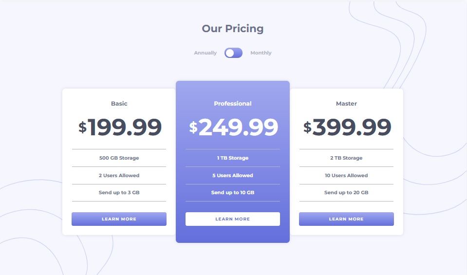
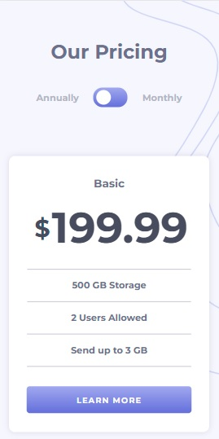
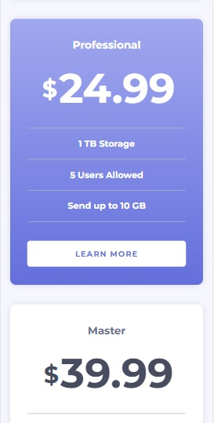

# Frontend Mentor - Pricing component with toggle solution

This is a solution to the [Pricing component with toggle challenge on Frontend Mentor](https://www.frontendmentor.io/challenges/pricing-component-with-toggle-8vPwRMIC). Frontend Mentor challenges help you improve your coding skills by building realistic projects. 

## Table of contents

- [Overview](#overview)
  - [The challenge](#the-challenge)
  - [Screenshot](#screenshot)
  - [Links](#links)
- [My process](#my-process)
  - [Built with](#built-with)
  - [What I learned](#what-i-learned)
  - [Continued development](#continued-development)
  - [Useful resources](#useful-resources)
- [Author](#author)
- [Acknowledgments](#acknowledgments)

## Overview

### The challenge

Users should be able to:

- View the optimal layout for the component depending on their device's screen size
- Control the toggle with both their mouse/trackpad and their keyboard
- **Bonus**: Complete the challenge with just HTML and CSS

### Screenshot

| Desktop layout |
|:--:|


| Mobile layout |
|:--:|
 

### Links

- Solution URL: https://github.com/PavlinaPs/react-pricing-component-with-toggle
- Live Site URL: https://pavlinaps.github.io/react-pricing-component-with-toggle/

## My process

### Built with

- Semantic HTML5 markup
- CSS custom properties
- Flexbox
- CSS Grid
- Mobile-first workflow
- [React](https://reactjs.org/) - JS library

### What I learned

This is a perfect challenge for React.js beginners.
**I am really happy how it went and excited about React.js!**
And I love ternary expressions!

- I used useState hook for the switch. The annual/monthly price changes according to state.
- I created a data.json file, this way another pricing block can be added anytime, I map over data's items and create \<PricingBlock /> component for each one:
```jsx
const PricingBlocks = (props) => {
  return (
    <div className="pricing__block-container">
      {data.items.map(item => (
        <PricingBlock 
            ...
        />
      ))}
    </div>
  )
}
```
- I conditionally added className for the white bullet inside the switch and for the block background.

```jsx
const PricingSwitch = (props) => {
  return (
    <div 
      className='pricing__switch'
      onClick={() => props.pricingChange()}>
      <div 
        className={props.switchAnnually ? "pricing__switch--annually" : "pricing__switch--monthly"}
      >
      </div>
    </div>
  )
}
```

### Continued development
I need to continue to add more features that React.js provides. 


### Useful resources

- [Dave Gray React tutorials](https://www.youtube.com/playlist?list=PL0Zuz27SZ-6PrE9srvEn8nbhOOyxnWXfp)

## Author

- GitHub - [PavlinaPs](https://github.com/PavlinaPs)
- Frontend Mentor - [@PavlinaPs](https://www.frontendmentor.io/profile/PavlinaPs)

## Acknowledgments

It is great that I can solve Frontend Mentor's challenges. They are all very useful for me. Every single one. Thank you!